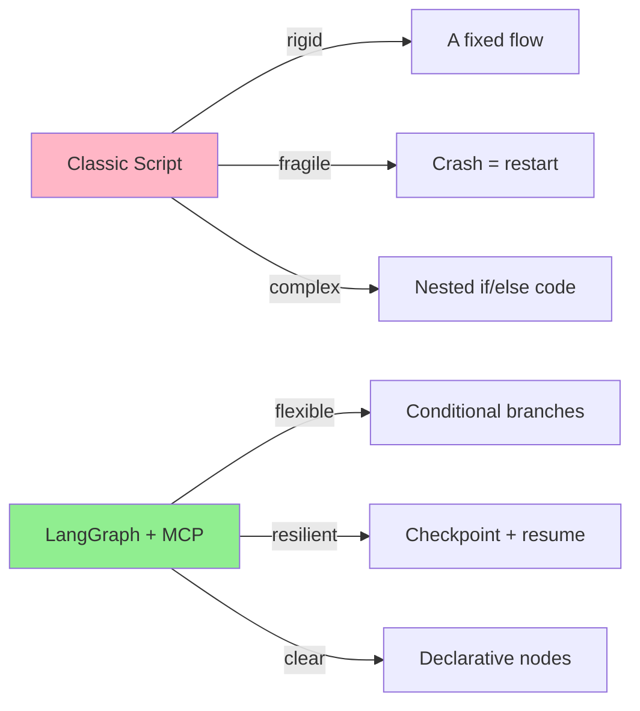
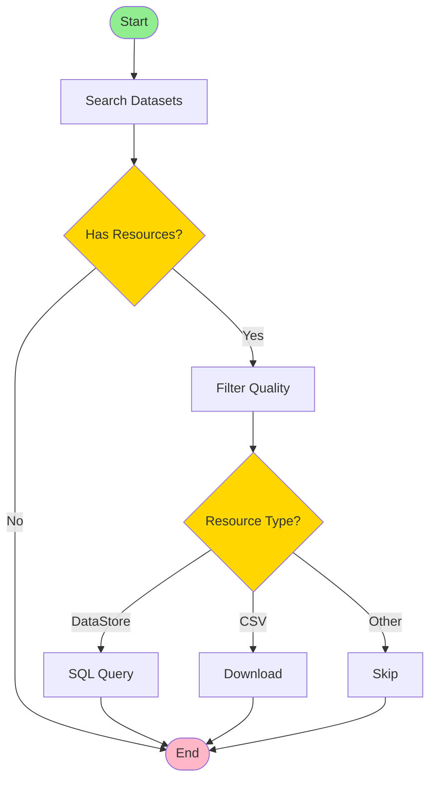
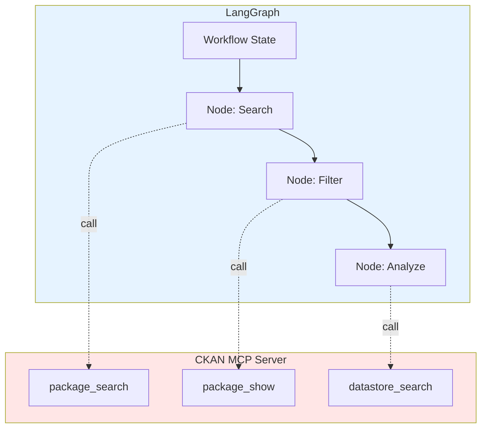
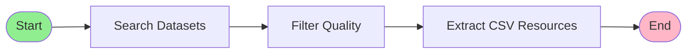
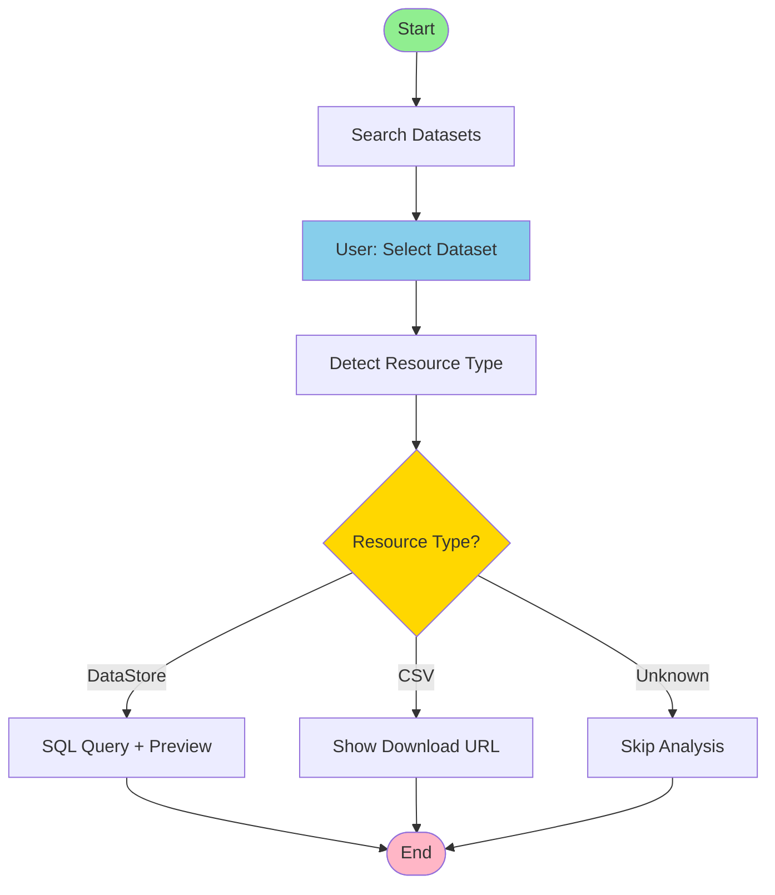

# LangGraph + CKAN MCP Server Examples

Orchestrate complex workflows for open data analysis: search, filter, and analyze CKAN datasets with smart workflows.

## Why This Combination Is Powerful

**Typical scenario without LangGraph:**
```python
# Rigid sequential script
datasets = search_ckan("mobility")
for ds in datasets:
    if has_csv(ds):
        download(ds)
    # What if I want to analyze DataStore? More code...
    # What if I want to ask for confirmation? Even more code...
    # What if the script crashes? Start over...
```

**With LangGraph + CKAN MCP:**
```python
# Flexible, stateful, resumable workflow
graph = StateGraph(State)
graph.add_node("search", search_datasets)
graph.add_conditional_edges("check_type", route_by_resource_type)
# Resumes where it left off, handles errors, adapts behavior
```

### Concrete Benefits



**1. Automatic State Management**
- Each workflow step has access to shared state
- No global variables or manual handoffs
- Easy debugging: `print(state)` in each node

**2. Conditional Branching**
- Adapts behavior to the data type found
- DataStore? -> SQL query
- CSV? -> Download
- Other formats? -> Skip or convert

**3. Human-in-the-Loop**
- Ask for confirmation before heavy operations
- Show previews and let the user choose
- Resume execution after input

**4. Resilience**
- Automatic checkpoints between nodes
- If it crashes: resume from the last completed step
- Configurable retry logic

---

## Quick Start

```bash
# 1. Build CKAN MCP Server (from repo root)
cd /path/to/ckan-mcp-server
npm install && npm run build

# 2. Test setup
cd examples/langgraph
uvx --with langgraph --with mcp --with langchain-core python test_setup.py

# 3. Run the basic workflow
uvx --with langgraph --with mcp --with langchain-core python 01_basic_workflow.py
```

**Output:**
```
[1/3] Searching datasets for: 'mobilità urbana'
   ✓ Found 51 total, showing 5

[2/3] Filtering by metadata quality
   ✓ Mobilità urbana: 73/100 (good)
   ✓ INTERVENTI PER LA MOBILITÀ URBANA: 68/100 (good)
   → 5/5 datasets pass quality threshold (40)

[3/3] Extracting CSV resources
   ✓ Found 4 CSV resources
```

---

## What Is LangGraph

[LangGraph](https://python.langchain.com/docs/langgraph/) is a framework to build **stateful agents** with execution graphs. Think of a workflow as a graph:



Each node is a function. The edges define flow. State propagates automatically.

**Key capabilities:**
- **Durable execution**: persistent workflow, resumes after crashes
- **State management**: tracks state across multiple steps
- **Conditional routing**: dynamic branches based on data
- **Human-in-the-loop**: pause for user input
- **Memory**: remembers previous interactions
- **Streaming**: real-time updates

## Why LangGraph + CKAN MCP

The CKAN MCP Server provides **atomic tools** (package_search, datastore_search, etc.). LangGraph orchestrates them into **smart workflows**:



**Separation of concerns:**
- **CKAN MCP**: provides data access (stateless, single-purpose tools)
- **LangGraph**: coordinates business logic (stateful, complex workflows)

**Concrete example:**

*Multi-stage search with adaptive decisions*

1. Search "mobilità urbana" on dati.gov.it
2. If < 10 results -> broaden query to "trasporti"
3. Filter datasets with quality score > 60
4. For each dataset:
   - If it has DataStore -> sample 100 rows with SQL
   - If it has CSV -> download and analyze with DuckDB
   - Otherwise -> skip
5. Aggregate results and generate a report

With a classic script: 200+ lines, tangled logic, hard to debug.
With LangGraph: 6 declarative nodes, visible flow, maintainable.

---

## Available Examples

### 0. Setup Test (`test_setup.py`)

Verify prerequisites:

```bash
uvx --with langgraph --with mcp --with langchain-core python test_setup.py
```

Checks:
- Python dependencies (langgraph, mcp, langchain-core)
- Node.js >= 18
- `dist/index.js` built

---

### 1. Basic Workflow (`01_basic_workflow.py`)

**Sequential workflow** for dataset search and analysis.



**What it does:**
1. Search datasets by keyword ("mobilità urbana")
2. **Filter by metadata quality** using a 0-100 scorer:
   - Completeness (30pt): title, description, license, org
   - Richness (30pt): description length, tags, coverage
   - Resources (30pt): open formats, DataStore
   - Freshness (10pt): last update
3. Extract CSV resources
4. Show results

**Run:**
```bash
uvx --with langgraph --with mcp --with langchain-core python 01_basic_workflow.py
```

**Example output:**
```
[1/3] Searching datasets for: 'mobilità urbana'
   ✓ Found 51 total, showing 5

[2/3] Filtering by metadata quality
   ✓ Mobilità urbana: 73/100 (good)
   ✓ INTERVENTI MOBILITÀ URBANA INTERVENTIONS 2010: 68/100 (good)
   ✓ INTERVENTI MOBILITÀ URBANA INTERVENTIONS 2011: 65/100 (good)
   ✓ Dataset trasporti Palermo: 62/100 (acceptable)
   ✓ Mobilità sostenibile: 74/100 (good)
   → 5/5 datasets pass quality threshold (40)

[3/3] Extracting CSV resources
   ✓ Found 4 CSV resources

Query: mobilità urbana
Total datasets: 5
Quality datasets: 5
CSV resources: 4
```

**Pattern demonstrated:** Sequential pipeline with state propagation

---

### 2. Data Exploration (`02_data_exploration.py`)

**Workflow with conditional branching** and human-in-the-loop.



**What it does:**
1. Search datasets ("trasporti")
2. **Human-in-the-loop**: show list, user picks (simulated)
3. Detect resource type automatically
4. **Conditional routing**:
   - `datastore_active=true` -> SQL query with LIMIT
   - `format=CSV` -> download URL for DuckDB
   - Other -> skip
5. Adaptive analysis based on type

**Run:**
```bash
uvx --with langgraph --with mcp --with langchain-core python 02_data_exploration.py
```

**Example output:**
```
[SEARCH] Query: 'trasporti'
   ✓ Found 2983 total, showing 5

[SELECT DATASET] Available datasets:

1. Evoluzione offerta trasporto ferroviario merci
   Resources: 2
   Org: Autorità regolazione trasporti

2. Diffusione TAXI e NCC
   Resources: 1
   Org: Autorità regolazione trasporti

3. Trafori internazionali
   Resources: 2
   Org: Autorità regolazione trasporti

   → Selected: Evoluzione offerta trasporto ferroviario merci

[SELECT RESOURCE]
Available resources:
1. Offerta trasporti ferroviario merci (2018-2022) (CSV)
2. Offerta trasporti ferroviario merci (2019-2023) (CSV)

   → Type: CSV (download required)

[ANALYZE CSV]
   → URL: https://bdt.autorita-trasporti.it/[...]/D12-Offerta-merci.csv
   (Download and analyze with DuckDB/pandas)

WORKFLOW RESULT:
Analysis Type: csv
URL: https://bdt.autorita-trasporti.it/[...]
```

**Pattern demonstrated:** Conditional branching + human-in-the-loop

---

### 3. Metadata Quality Scorer (`metadata_quality.py`)

Reusable module to evaluate CKAN metadata quality.

**Scoring criteria (0-100):**

| Category | Weight | Criteria |
|-----------|------|---------|
| **Completeness** | 30pt | Title, description, license, organization, contact |
| **Richness** | 30pt | Description length (>200 chars), tags (>2), temporal coverage |
| **Resources** | 30pt | Open formats (CSV/JSON/XML), active DataStore, valid URLs |
| **Freshness** | 10pt | Updated in the last 12 months |

**Quality levels:**
- `excellent` (80-100): complete and rich metadata
- `good` (60-79): good quality, some missing fields
- `acceptable` (40-59): basic metadata present
- `poor` (0-39): many missing fields

**Standalone test:**
```bash
uvx python metadata_quality.py
```

**Output:**
```python
{
    "score": 73,
    "level": "good",
    "breakdown": {
        "completeness": 24,  # 24/30
        "richness": 22,      # 22/30
        "resources": 20,     # 20/30
        "freshness": 7       # 7/10
    },
    "reasons": [
        "Has complete title and description",
        "Has 5 tags and temporal coverage",
        "2 open format resources with DataStore",
        "Updated 3 months ago"
    ]
}
```

---

## Prerequisites

### 1. Build CKAN MCP Server

The examples connect to the local server via stdio.

```bash
# From the repo root
cd /path/to/ckan-mcp-server
npm install
npm run build
```

Verify that `dist/index.js` exists.

### 2. Install uv (Recommended)

[uv](https://docs.astral.sh/uv/) is the fastest way to test:

```bash
# macOS/Linux
curl -LsSf https://astral.sh/uv/install.sh | sh

# Windows
powershell -c "irm https://astral.sh/uv/install.ps1 | iex"
```

Or use classic pip/venv (see below).

---

## Installation

### Method 1: Quick Test with uvx (Zero Install)

Test without installing anything permanently:

```bash
cd examples/langgraph

# Quick test
uvx --with langgraph --with mcp --with langchain-core \
    python 01_basic_workflow.py
```

`uvx` creates an isolated environment, installs dependencies, runs, then cleans up.

### Method 2: Classic Virtual Environment

```bash
# Create venv
python3 -m venv venv
source venv/bin/activate  # Windows: venv\Scripts\activate

# Install dependencies
pip install -r requirements.txt

# Run examples
python 01_basic_workflow.py
python 02_data_exploration.py
```

### Method 3: Automated Setup

```bash
# Full setup (venv + install)
./setup.sh

# Activate
source venv/bin/activate

# Run
python 01_basic_workflow.py
```

---

## Architectural Patterns

### Pattern 1: Sequential Pipeline

Linear workflow where each step depends on the previous one.

```python
graph = StateGraph(State)

# Define nodes
graph.add_node("search", search_datasets_node)
graph.add_node("filter", filter_quality_node)
graph.add_node("extract", extract_resources_node)

# Connect sequentially
graph.add_edge(START, "search")
graph.add_edge("search", "filter")
graph.add_edge("filter", "extract")
graph.add_edge("extract", END)
```

**Use case:** ETL, report generation, data pipelines.

---

### Pattern 2: Conditional Branching

Workflow that adapts at runtime based on data.

```python
def route_by_resource_type(state: State) -> str:
    """Decide path based on resource type."""
    resource = state["selected_resource"]
    if resource.get("datastore_active"):
        return "analyze_datastore"
    elif resource.get("format") == "CSV":
        return "analyze_csv"
    else:
        return "skip"

graph.add_conditional_edges(
    "select_resource",
    route_by_resource_type,
    {
        "analyze_datastore": "datastore_node",
        "analyze_csv": "csv_node",
        "skip": "skip_node"
    }
)
```

**Use case:** Adapt analysis to data type, handle multiple formats.

---

### Pattern 3: Human-in-the-Loop

Workflow that requires user input before proceeding.

```python
async def select_dataset_node(state: State) -> State:
    """Show options and get user selection."""
    print("Available datasets:")
    for i, ds in enumerate(state["datasets"]):
        print(f"{i+1}. {ds['title']}")
    
    # In production: use input() or web UI
    selection = int(input("Select dataset: ")) - 1
    state["selected"] = state["datasets"][selection]
    return state
```

**Use case:** Qualitative decisions, data cleaning, validation.

---

### Pattern 4: Parallel Execution

Run nodes in parallel for performance (future example).

```python
# Query multiple CKAN portals simultaneously
from langgraph.pregel import Pregel

results = await graph.arun_parallel([
    {"query": "mobility", "server": "dati.gov.it"},
    {"query": "mobility", "server": "data.gov"},
    {"query": "mobilite", "server": "data.gouv.fr"}
])
```

**Use case:** Multi-source aggregation, comparative analysis.

---

## MCP Client Integration

The examples use the [MCP Python SDK](https://github.com/modelcontextprotocol/python-sdk) to communicate with CKAN MCP Server via stdio.

```python
from mcp import ClientSession, StdioServerParameters
from mcp.client.stdio import stdio_client

# Connect to local server
server_params = StdioServerParameters(
    command="node",
    args=["../../dist/index.js"]
)

async with stdio_client(server_params) as (read, write):
    async with ClientSession(read, write) as session:
        await session.initialize()
        
        # Call MCP tool
        result = await session.call_tool(
            "ckan_package_search",
            arguments={
                "server_url": "https://www.dati.gov.it/opendata",
                "q": "mobilità urbana",
                "rows": 5,
                "response_format": "json"
            }
        )
        
        # Parse response
        for content in result.content:
            if content.type == "text":
                data = json.loads(content.text)
                datasets = data["results"]
```

**Important note:** 
- Response format: use `response_format` (not `format`)
- Response structure: CKAN result is direct, not wrapped in `{success, result}`
- JSON parsing: handle truncation if response > 50KB

---

## Debugging with LangSmith

To visualize workflows graphically:

```bash
# Setup LangSmith (free up to 5k traces/month)
export LANGCHAIN_TRACING_V2=true
export LANGCHAIN_API_KEY=your_api_key

# Run with tracing
uvx --with langgraph --with mcp --with langchain-core --with langsmith \
    python 01_basic_workflow.py
```

View traces at [smith.langchain.com](https://smith.langchain.com):
- See each node executed
- Timing for each step
- State evolution
- Errors and retries

---

## Troubleshooting

### ❌ `dist/index.js` not found

```bash
# Build the server from repo root
cd ../..
npm run build
cd examples/langgraph
```

### ❌ `Cannot connect to MCP server`

Verify Node.js and file:

```bash
node --version  # Must be >= 18
ls -la ../../dist/index.js  # Must exist
```

### ❌ JSON parse error / Response truncated

Some CKAN queries return huge metadata (>50KB) that gets truncated.

**Solution:** Use specific queries instead of generic ones:
- ✅ Works: `trasporti`, `mobilità urbana`, `sanità`
- ❌ Problems: `CSV`, `data`, `popolazione` (too generic)

```python
# In script, change query
initial_state = {
    "query": "trasporti",  # Specific ✅
    # "query": "CSV",      # Generic ❌
}
```

### ❌ Timeout on dati.gov.it

The portal can be slow. Reduce `rows`:

```python
SEARCH_ROWS = 3  # Instead of 10
```

### ❌ Import errors with uvx

If `uvx` fails, use classic venv:

```bash
python3 -m venv venv
source venv/bin/activate
pip install -r requirements.txt
python 01_basic_workflow.py
```

---

## Configuration

The examples default to `dati.gov.it`. To change:

```python
# In script, edit:
CKAN_SERVER = "https://data.gov"  # US portal
# CKAN_SERVER = "https://demo.ckan.org"  # Demo
```

Other CKAN portals: [instances.ckan.org](https://instances.ckan.org)

---

## Next Steps

**Patterns to add:**

1. **Multi-Region Analysis**: Parallel queries across multiple portals, aggregate results
2. **Streaming Updates**: Show real-time progress with `StreamingStdOutCallbackHandler`
3. **Error Recovery**: Retry logic with exponential backoff
4. **Memory Persistence**: Save checkpoints to disk, resume days later
5. **LangGraph Studio**: Visual UI to build and debug workflows

Contribute by adding examples in this directory!

---

## Resources

- [LangGraph Documentation](https://python.langchain.com/docs/langgraph/)
- [LangGraph Tutorials](https://langchain-ai.github.io/langgraph/tutorials/)
- [MCP Protocol](https://modelcontextprotocol.io)
- [CKAN MCP Server](../../README.md)
- [LangSmith](https://docs.smith.langchain.com)
- [CKAN API Guide](https://docs.ckan.org/en/latest/api/)

---

## License

Same license as the parent project (see root README).
